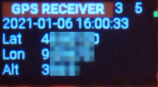
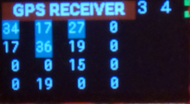
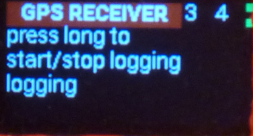
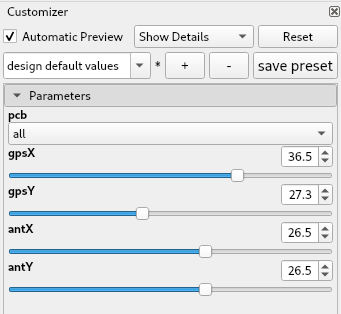
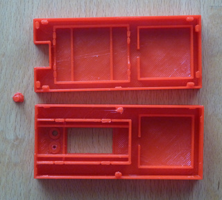
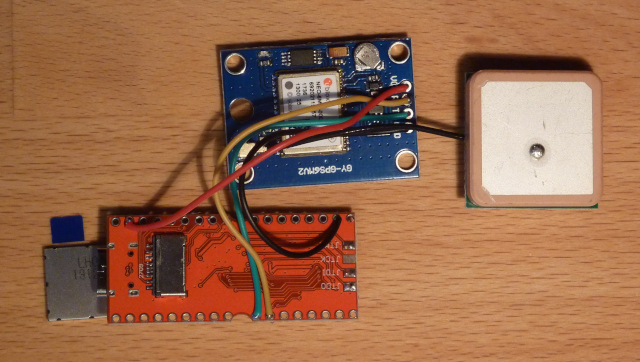
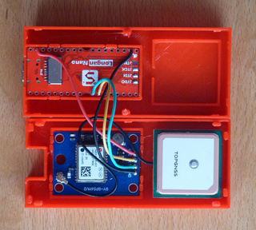
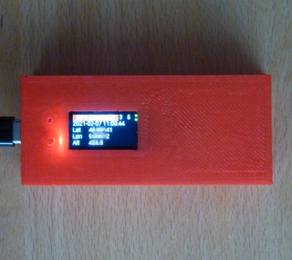

# GPS Receiver and Logger

Using a ```u-blox NEO-6M``` GPS module and a ```Longan Nano``` to display and record UTC time and GPS position data.

## Usage

   

The GPS Receiver has three screens: *GPS Position*, *Satellite Info* and *Logging*. Use a short button press to toggle between *GPS Position* screen and *Satellite Info* screen. A long button press will select the *Logging* screen. Another long button press will start / stop logging to the SD card.

The top line of all screens show
- GPS fix (0: none; 2: 2D fix; 3: 3D fix)
- number of used satellites
- GPS module connection indicator (green blinking: connected, red: connection lost)
- Logging status indicator (red: logging off, green: logging data, yellow: waiting for data)

## Logging

The logging will start when the UTC time and GPS position are found and will then be update every five seconds. The file name will be the start UTC time with the extension csv.
Always stop logging before power off, else data will be lost and the file system might get corrupted.

The logfile format is compatible with [GPSBabel](http://www.gpsbabel.org/index.html)'s [unicsv](http://www.gpsbabel.org/htmldoc-1.7.0/fmt_unicsv.html) format. GPSBabel can convert the logfile to many different formats (try ```gpsbabel -h``` for a full list of formats). E.g. to create a kml file for Google Earth use the command:

```
gpsbabel -i unicsv -f 'yyymmdd hhmmss.csv' -o kml -F 'yyymmdd hhmmss.kml'
```

## Compilation

A ```Longan Nano``` is required, the ```Longan Nano Lite``` has not enough memory.
Use the PlatformIO environment option to select which USART the GPS module is connected to: ```-e usart0``` or ```-e usart1```.

```
pio run -e usart0 -t upload
```

## 3D Print STL files

 
 
 
 
 

The [OpenSCAD](http://www.openscad.org/downloads.html) file ```hw/gps.scad``` can be used to create STL files for a 3D printed housing. The dimensions of the GPS board and antenna can be changed using the Customizer: In menu *View* uncheck *Hide Customizer*, in the Customizer dialog modify the parameters, press *F6* and then *F7* to create the STL files. When printing the button might need a brim.
